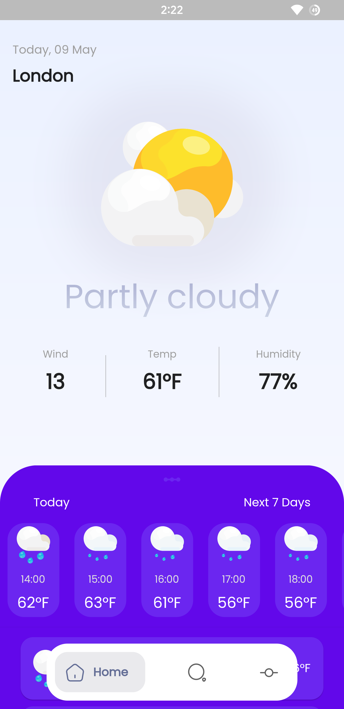
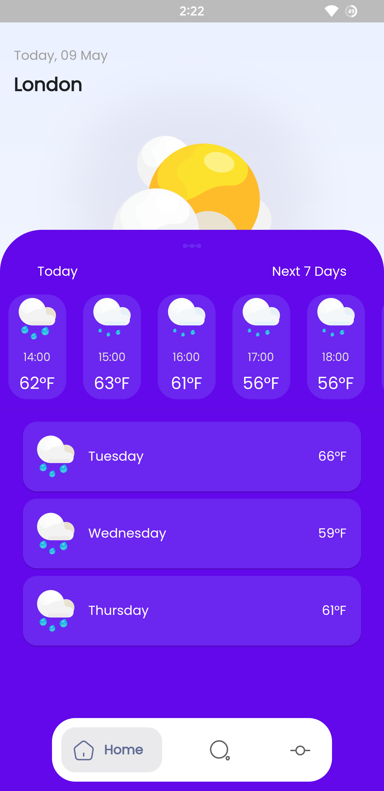
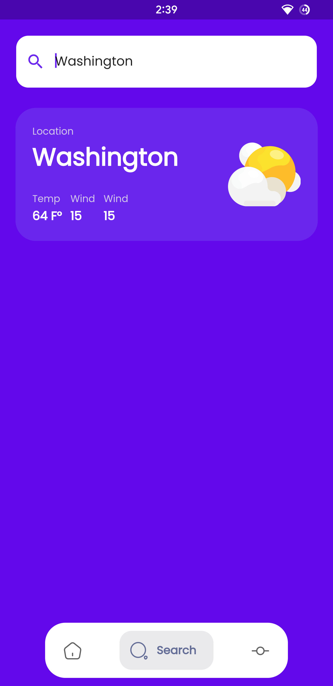
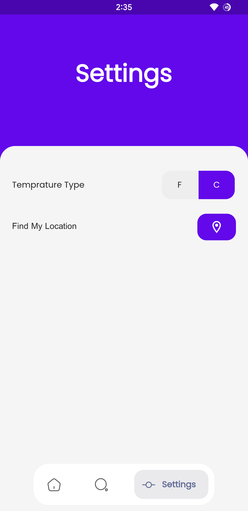

# Weather App

## 📚 Description

Flutter Weather Application for iOS and Android that uses Weather API to get the latest weather forecasts.

## ✨ Features

- ✅ Getting current weather
- ✅ Know weather forecast for the rest of the day
- ✅ Getting weather forecast of the week
- ✅ Searching Cities
- ✅ Pin Cities to know their weather right away 
- ✅ Beautiful UI
- ...

## ⚙️ Installation

1. 📥 Clone the repository: `git clone https://github.com/Harrem/weather_app.git`
2. 📂 Change to the project directory: `cd weather_app`
3. 🚀 Run `flutter pub get` to install dependencies.
4. 📱 Connect your device/emulator and run the app: `flutter run`

## 🧩 Dependencies

- 📦 Dio v2.4: Description of dependency 1.
- 📦 Dependency 2: Description of dependency 2.
- 📦 sliding_up_panel: ^2.0.0+1
- 📦 cupertino_icons: ^1.0.2
- 📦 google_nav_bar: ^5.0.6
- 📦 toggle_switch: ^2.0.1
- 📦 flutter_svg: any
- 📦 google_fonts: ^3.0.1
- 📦 geolocator: ^9.0.1
- 📦 geocoding: ^2.0.4
- 📦 location: ^4.4.0
- 📦 provider: ^6.0.3
- 📦 intl: any
- 📦 get_storage: ^2.0.3
- 📦 iconsax: ^0.0.8
- 📦 dio_http_cache: ^0.3.0
- 📦 carousel_slider: ^4.1.1
- 📦 http: ^0.13.5
- ...

## 💡 Usage

1. **Home Screen**: The home screen is the main screen of the weather app. It provides you with essential weather information in a glance. Here's how to use it:

   - Current Weather: The top section displays the current weather conditions, including temperature, weather description, and any additional relevant information such as humidity or wind speed.
   - Next 3 Days: Scroll down to view the weather forecast for the next three days. Each day shows the expected high and low temperatures, weather conditions, and an icon representing the weather type.
   - Hourly Forecast: Swipe horizontally to access the hourly forecast, which shows the weather conditions for the next few hours. It provides temperature, weather description, and an icon indicating the weather type.

2. **Search Screen**: The search screen allows you to explore weather conditions in different locations. Follow these steps to use it:

   - Tap on the search icon or navigate to the search screen from the home screen.
   - Enter the name of the desired location in the search bar.
   - As you type, the app will provide suggestions and auto-complete options.
   - Select the desired location from the search results to view the weather information for that location.

3. **Settings Screen**: The settings screen allows you to personalize the app according to your preferences. Here's how to customize it:

   - Access the settings screen by tapping on the settings icon or navigating from the home screen.
   - Toggle between Celsius and Fahrenheit: Choose the temperature unit you prefer by selecting either Celsius or Fahrenheit.
   - Set Default Location: Enable the "Use Current Location" option to automatically set your current location as the default. The app will use GPS and location services to determine your location accurately.

Note: The weather app provides you with accurate weather information, allowing you to stay informed about current conditions, plan for the next few days, and explore weather details in various locations with ease. Enjoy the app and stay prepared for any weather changes!

## 📸 Screenshots

  
  
  
 

## 🤝 Contributing

If you'd like to contribute to the project, please follow these steps:

1. 🍴 Fork the repository.
2. 🌿 Create a new branch: `git checkout -b my-new-feature`.
3. 🛠️ Make your changes and commit them: `git commit -am 'Add some feature'`.
4. ⬆️ Push to the branch: `git push origin my-new-feature`.
5. 🔄 Submit a pull request.

## 📄 License

This project is licensed under the MIT License. You can find the details in the [LICENSE](LICENSE) file.

## 📞 Contact

If you have any questions or need further assistance regarding the project, feel free to reach out to us through the following channels:

- Email:
  - Harem Mhamad: [haremmhamad99@gmail.com](mailto:haremmhamad99@gmail.com)
  - Hawdang Najah: [hawdangnajah31@gmail.com](mailto:hawdangnajah31@gmail.com)

- Discord: 
- WhatsApp: 

Feel free to contact us through any of the above channels. We'll be happy to assist you!

## 🌟 Acknowledgments

We would like to express our gratitude to Hawdang Najah for their valuable contribution to the project. Their involvement and dedication have greatly enhanced the development process. Thank you, Hawdang, for your friendship and contribution.

# Weatherly

Flutter Weather Application for iOS and Android that uses Weather API to get the latest weather forecasts.

## Features
  * Getting current weather
  * Know weather forecast for the rest of the day
  * Getting weather forecast of the week
  * Searching Cities
  * Pin Cities to know their weather right away 
  * Beautiful UI

